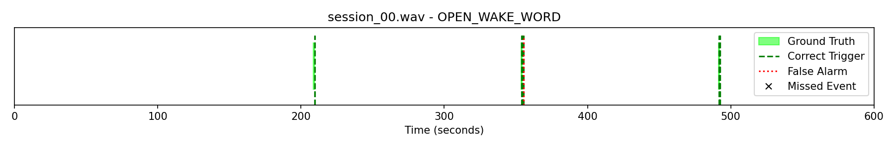

## 1) Repo layout
```
ww_benchmark/
├─ data/
│  ├─ DEMAND/
│  ├─ LibriSpeech/
│  |  └─ audio
│  |     └─ train-100
│  ├─ negatives/
│  ├─ positives/
│  └─ sessions/
│  engines.py
├─ eval_threaded.py
├─ flac2wav.py
├─ generate_confusables_alexa.py (WIP)
├─ generate_mixed_sessions.py
├─ generate_negatives_librispeech_demand.py
├─ generate_positives.py
├─ plot_triggers.py
└─ README.md
```
## Install requirements
```console
python -m pip install -r requirements.txt
```

## Download data
[LibriSpeech](http://www.openslr.org/12/) (test_clean portion) is used as background dataset. It can be downloaded
from [OpenSLR](http://www.openslr.org/resources/12/test-clean.tar.gz).

Extract to data/Librispeech/audio and rename to train-100.

Convert .flac to .wav:
```console
python flac2wav.py
```

In order to simulate real-world situations, the data is mixed with noise (at 10 dB SNR). For this purpose, we use
[DEMAND](https://doi.org/10.1121/1.4799597) dataset which has noise recording in 18 different environments
(e.g. kitchen, office, traffic, etc.). It can be downloaded
from [Kaggle](https://www.kaggle.com/aanhari/demand-dataset).

Extract to data/DEMAND.
## Generate positive samples
Download piper-tts models
```console
mkdir models
cd models
python -m piper.download_voices en_US-amy-medium
python -m piper.download_voices en_US-arctic-medium
python -m piper.download_voices en_US-bryce-medium
python -m piper.download_voices en_US-hfc_female-medium
python -m piper.download_voices en_US-hfc_male-medium
python -m piper.download_voices en_US-joe-medium
python -m piper.download_voices en_US-john-medium
python -m piper.download_voices en_US-kristin-medium
python -m piper.download_voices en_US-norman-medium
python -m piper.download_voices en_US-reza_ibrahim-medium
python -m piper.download_voices en_US-ryan-high
python -m piper.download_voices en_US-ryan-medium
python -m piper.download_voices en_US-sam-medium
```

Generate positive samples with piper-tts:
```console
python generate_positives.py
```

Generate negative samples with LibriSpeech and DEMAND:
```console
python generate_negatives_librispeech_demand.py
```

## Generate sessions samples
Generate evaluation sessions with LibriSpeech, DEMAND and positive samples:
```console
python generate_mixed_sessions.py
```

## Evaluate using session audio samples
```console
python eval_threaded.py
```

Plot wake up word detections:
```console
python pĺot_triggers.py --model-name <MODEL_NAME>
```

